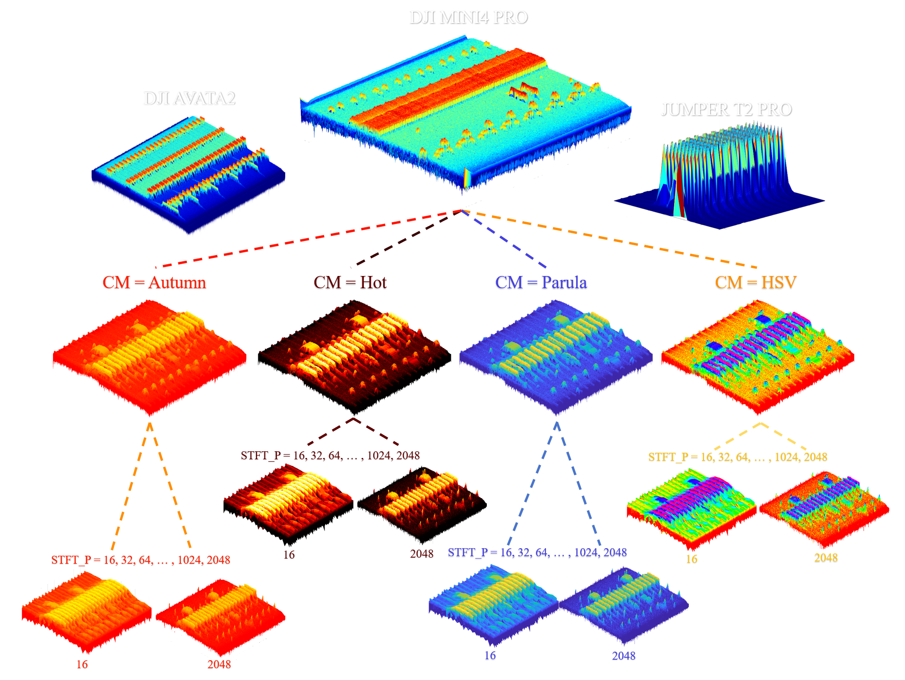
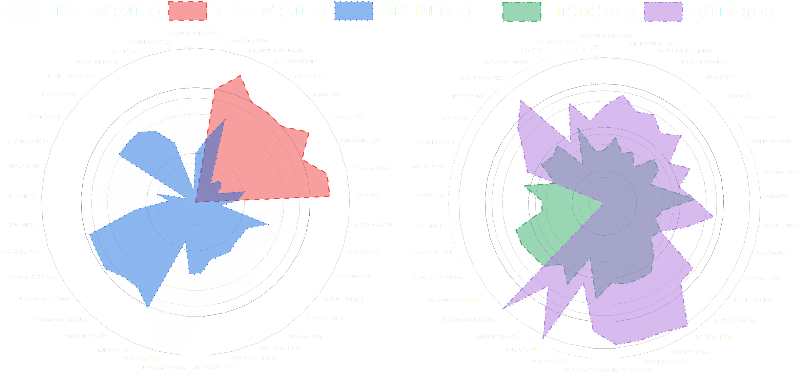
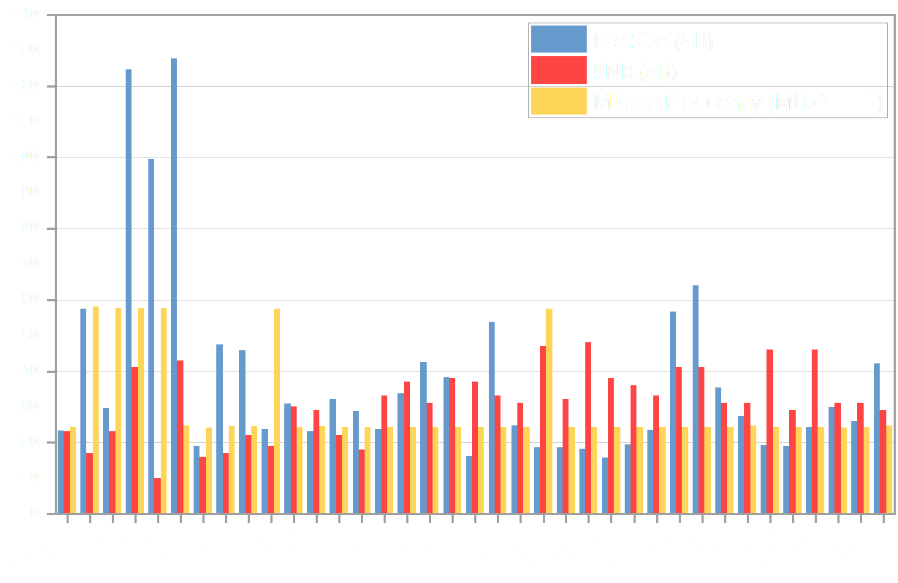

# SADAR — Spectrum Anomaly Detection & Analysis Radar 📡

[](https://reactjs.org/)
[](https://fastapi.tiangolo.com/)
[](https://tailwindcss.com/)
[](https://www.python.org/)
[](LICENSE)

SADAR is a high-fidelity, real-time Radio Frequency (RF) spectrum monitoring, anomaly detection, and analysis dashboard. Sporting a military-grade "Cyber-Glow" design, it detects, classifies, and tracks RF activities (Normal signals, active Jamming, and Drone threats).

---

## 🖥️ System Preview & Architecture

### Live Interactive Dashboard
The frontend displays real-time telemetry, location maps, signal feeds, and a tactical AI co-pilot assistant.


### Signal Analysis & Flowchart Pipeline
The diagram below shows how raw RF signals are ingested, processed, classified via the PyTorch ensemble model, and dispatched to the dashboard and alert system:


### Finite State Machine (FSM) Anomaly Alert Flow
Below is the state transitions and alerting logic governing signal ingestion, verification, and critical escalation (e.g., triggering email alerts):


---

## ⚡ Key Features

- **Real-Time Telemetry:** Visualizes high-frequency RF signal logs with sub-millisecond latency using WebSockets.
- **PyTorch Ensemble Classification:** Utilizes a PyTorch model loader supporting custom RF classification pipelines.
- **Fail-Safe Fallback Layer:** Features a rule-based signal ingestion fallback if heavy machine learning dependencies are missing or if the hardware is constrained.
- **Tactical AI Copilot Agent:** Integrated, context-aware chatbot capable of analyzing RF signal logs, detailing threat scores, and generating reports.
- **Professional Terminal Simulators:** Dynamic console dashboards to simulate active environments for testing.

---

## 🛠️ Technology Stack

| Layer | Technologies |
| :--- | :--- |
| **Frontend** | React 18, TypeScript, Vite, TailwindCSS (Custom Dark Theme), Recharts, Zustand, Leaflet Maps |
| **Backend** | FastAPI, WebSockets, Python 3.14, Uvicorn, Pydantic v2 |
| **Machine Learning** | PyTorch, NumPy, SciPy, Sentence-Transformers |

---

## ⚙️ Getting Started & Installation

### Prerequisites
- [Node.js](https://nodejs.org/) (v18+)
- [Python](https://www.python.org/) (v3.9+)

### 1. Repository Setup
```bash
git clone https://github.com/GhariebML/SADAR_NEW.git
cd SADAR_NEW
```

### 2. Backend Setup
If you are running in a **disk-space constrained environment** (such as a full `C:` drive), we recommend creating the virtual environment on an alternate drive (e.g., `D:`) and redirecting `pip` caches:

```powershell
# Create virtual environment
python -m venv d:\SADAR_NEW\venv

# Activate venv & redirect pip temp/cache directories
$env:TMP="d:\SADAR_NEW\tmp"
$env:TEMP="d:\SADAR_NEW\tmp"
$env:PIP_CACHE_DIR="d:\SADAR_NEW\pip_cache"

# Install dependencies
d:\SADAR_NEW\venv\Scripts\python.exe -m pip install fastapi "uvicorn[standard]" python-multipart pillow cryptography httpx websockets pydantic pydantic-settings python-dotenv aiofiles requests sentence-transformers numpy scipy
```

To run the backend server:
```powershell
cd backend
..\venv\Scripts\python.exe -m uvicorn src.api.main:app --reload --port 8000
```

### 3. Frontend Setup
```bash
cd frontend
npm install
npm run dev
```

The React dashboard will be running at `http://localhost:5173`.
The API docs will be accessible at `http://localhost:8000/docs`.

---

## 📡 Simulation & Live Demos

Two advanced terminal simulators are included for testing and presenting the system's capabilities:

### A. Live Interactive Presenter Demo (`pro_demo_scanner.py`)
Perfect for presentation. Automatically broadcasts normal background signals, and allows you to manually trigger red alerts, jamming warnings, or unknown signals instantly:
```powershell
# From the project root directory
.\venv\Scripts\python.exe pro_demo_scanner.py
```

### B. Automatic Random Simulation (`pro_mock_scanner.py`)
Generates mock RF activities utilizing Gaussian distributions, logs the activity to a cyberpunk terminal dashboard, and pushes payloads to the FastAPI backend:
```powershell
# From the project root directory
.\venv\Scripts\python.exe pro_mock_scanner.py
```

---

## 📁 Repository Directory Structure

```text
SADAR_NEW/
├── backend/
│   ├── data/                 # SQLite database & static mock data
│   ├── src/
│   │   ├── ai_agent/         # Copilot logic & prompt templates
│   │   ├── ai_model/         # PyTorch ensemble loader
│   │   ├── api/              # FastAPI endpoints, routes & websockets
│   │   └── database/         # Database models & connections
│   └── trigger_test_alert.py # Script to manually fire test alerts
├── frontend/
│   ├── src/                  # React components, state, & styling
│   ├── package.json
│   └── vite.config.ts
├── scripts/
│   └── start.bat             # Startup automation script
├── pro_demo_scanner.py       # Interactive terminal simulator
├── pro_mock_scanner.py       # Live dashboard terminal simulator
├── FVFPP.png                 # Signal pipeline flowchart
├── FSM.png                   # Finite State Machine alert logic
└── profile.png               # System dashboard preview
```

---

## 🛡️ License

This project is licensed under the MIT License - see the [LICENSE](LICENSE) file for details.
